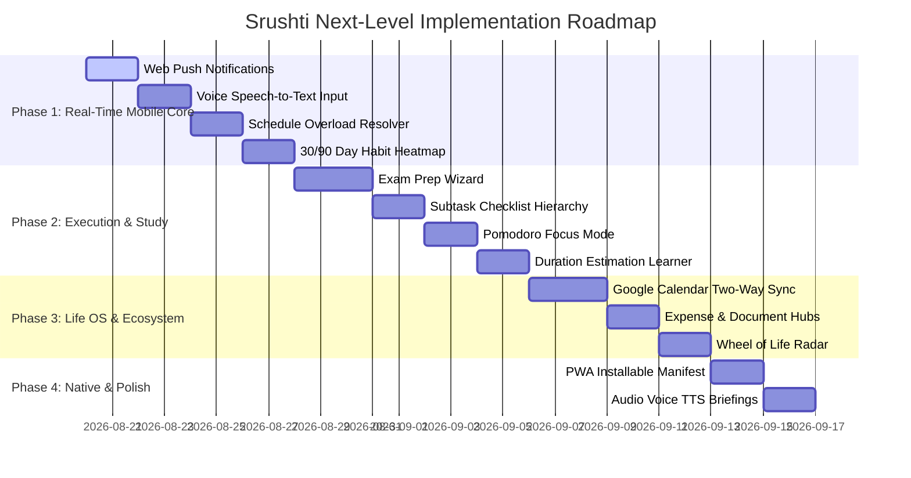

# 🌱 SRUSHTI AI — Master Next-Level Roadmap & 20 Key Features

**Generated Date:** August 19, 2026  
**Project:** SRUSHTI — My Personal Assistant & Life Management Engine  
**Version Target:** v2.0 Production & Mobile Native Ecosystem  

---

## 🎯 Executive Overview

Srushti currently has a solid, complete foundation: Next.js 15, Prisma ORM, local SQLite database, fast streaming AI with Gemini 3.6 Flash, a mobile-first floating dock design, vibrant light theme system, interactive Home command center, Calendar, Goals, Habits, Productivity, Notifications, and Settings.

This roadmap outlines the **Top 20 Critical Next-Level Features & Capabilities** required to elevate Srushti into an industry-leading, truly persistent, autonomous personal PA.

---

## 🏆 Top 20 Features Ranked by Priority

```text
┌───────────────────────────────────────────────────────────────┐
│ P0: Core Life Management & Real-Time Mobile Pillars (1 - 4)  │
│ P1: Advanced Execution, Study & Time Intelligence (5 - 10)    │
│ P2: Ecosystem Integrations, Life OS & Finance (11 - 16)       │
│ P3: PWA Mobile Native, Audio & Multi-User Expansion (17 - 20) │
└───────────────────────────────────────────────────────────────┘
```

---

### 🔥 Priority 0: Core Life Management & Real-Time Mobile Pillars

#### 1. 🔔 Web Push & Native Background Notification Service Worker
- **Priority:** **`P0 — Critical`**
- **Description:** Real mobile browser notifications that fire lockscreen alerts at scheduled times even when the tab is closed.
- **Why Needed:** An assistant cannot act as a true PA without persistent alarms and time-sensitive reminders.

#### 2. ⚡ Automated Schedule Overload & Conflict Resolution Engine
- **Priority:** **`P0 — Critical`**
- **Description:** When the user has more planned hours than available free hours in a day, Srushti proactively triggers an interactive negotiation sheet (*"You have 7h of tasks but only 4h free. Shall I move low-priority items or compress durations?"*).
- **Why Needed:** Prevents impossible schedules from ever being created.

#### 3. 🎙️ Voice Input & Live Speech-to-Text Dictation
- **Priority:** **`P0 — Critical`**
- **Description:** Direct microphone button inside the chat interface allowing users to talk naturally to Srushti while walking, driving, or studying.
- **Why Needed:** Mobile assistants must allow zero-friction hands-free voice interaction.

#### 4. 📊 30/90-Day Visual Consistency Heatmap Matrix
- **Priority:** **`P0 — Critical`**
- **Description:** Full GitHub-style annual & monthly consistency matrix for daily habits, study routines, and tasks with streak milestone shields.
- **Why Needed:** Powerful psychological reinforcement for long-term consistency.

---

### ⚡ Priority 1: Advanced Execution, Study & Time Intelligence

#### 5. 📚 Guided Exam Preparation & Syllabus Deconstruction Wizard
- **Priority:** **`P1 — High`**
- **Description:** 3-step prompt wizard (*"I have X exam on date Y with N chapters"*). Automatically calculates required preparation hours, creates milestones, spreads study blocks across available slots, and adds buffer days.
- **Why Needed:** The primary academic success scenario described in the master prompt.

#### 6. 📝 Interactive Subtask Hierarchy & Checklist Dropdowns
- **Priority:** **`P1 — High`**
- **Description:** Expandable subtask checklists embedded directly inside task cards on Home and Calendar with individual progress percentages.
- **Why Needed:** Complex multi-step assignments need granular check-off capabilities.

#### 7. ⏱️ Focus Companion Mode & Pomodoro Timer
- **Priority:** **`P1 — High`**
- **Description:** Fullscreen / mini floating focus timer with ambient soundscapes (white noise, rain, lofi) linked directly to the active task, recording actual time spent into the database.
- **Why Needed:** Closes the loop between planning a task and executing it.

#### 8. 🧠 Behavioral Fatigue & Burnout Risk Detector
- **Priority:** **`P1 — High`**
- **Description:** AI safety algorithm that detects when the user schedules $\ge 6$ hours of high-cognitive tasks without breaks and recommends recovery periods.
- **Why Needed:** Ensures sustainable productivity without burnout.

#### 9. 📈 Dynamic Task Duration Estimation Learner
- **Priority:** **`P1 — High`**
- **Description:** Automatically learns historical time differences (e.g. user plans 30 mins for math but takes 55 mins) and auto-corrects future schedule recommendations.
- **Why Needed:** Core behavioral learning requirement from Section 19.

#### 10. 🔁 Advanced Recurring Rules Engine (Cron & Custom Frequencies)
- **Priority:** **`P1 — High`**
- **Description:** Custom recurring task support (e.g. *Every Monday & Thursday at 6:00 PM*, *First day of every month*, *Every 2 weeks*).
- **Why Needed:** Essential for university timetables, gym splits, and recurring meetings.

---

### 🌐 Priority 2: Ecosystem Integrations, Life OS & Finance

#### 11. 📅 Google Calendar & Apple iCal Two-Way Sync
- **Priority:** **`P2 — Medium`**
- **Description:** Two-way sync to import external university, college, and Google calendars directly into Srushti's schedule engine.
- **Why Needed:** Integrates Srushti with external commitments and institutional schedules.

#### 12. 💳 Smart Expense & Subscription Tracker Hub
- **Priority:** **`P2 — Medium`**
- **Description:** Dedicated screen for bills, tuition fees, rent, and monthly subscriptions created by the Finance Agent with due date alerts.
- **Why Needed:** Expands Srushti into full personal life and budget management.

#### 13. 📄 Document Vault & Expiry Reminder UI
- **Priority:** **`P2 — Medium`**
- **Description:** Dedicated document manager for tracking expiration dates of IDs, passports, certificates, licenses, and assignment submissions.
- **Why Needed:** Solves real-world document management overhead.

#### 14. 🧭 Wheel of Life & Strategic Trajectory Matrix
- **Priority:** **`P2 — Medium`**
- **Description:** Visual radar chart tracking balance across 6 life dimensions: *Academics/Career, Physical Health, Mental Wellbeing, Finance, Relationships, Personal Growth*.
- **Why Needed:** Gives users high-level macro clarity on their life direction.

#### 15. 🛡️ Autonomous Rescheduling Permission Boundaries
- **Priority:** **`P2 — Medium`**
- **Description:** Granular settings allowing users to configure what Srushti can auto-modify without asking (e.g. *Auto-move tasks $\le 30$ mins without approval, but ask for exams and high-priority deadlines*).
- **Why Needed:** Builds user trust while retaining autonomous power.

#### 16. 🔍 Long-Term Memory Search & Fact Editor
- **Priority:** **`P2 — Medium`**
- **Description:** Searchable, taggable Memory Vault interface allowing users to inspect, edit, categorize, or delete specific memories stored by Srushti.
- **Why Needed:** Ensures complete transparency and user data control.

---

### 🚀 Priority 3: Mobile Native PWA, Audio & Multi-User Expansion

#### 17. 🔊 Text-to-Speech Audio Morning Briefings
- **Priority:** **`P3 — Low / Polish`**
- **Description:** Srushti speaks the daily morning briefing aloud using natural AI voice synthesis upon tapping a "Play Briefing" button.
- **Why Needed:** Premium, futuristic personal assistant experience.

#### 18. 📱 Progressive Web App (PWA) Offline Manifest
- **Priority:** **`P3 — Low / Polish`**
- **Description:** Installable directly to iOS & Android home screen with app icon, standalone splash screen, and offline local cache.
- **Why Needed:** Delivers a 100% native mobile app feel.

#### 19. 📄 Weekly PDF / Email Life Summary Digest
- **Priority:** **`P3 — Low / Polish`**
- **Description:** Auto-generated weekly performance digest summarizing completion rates, focus hours, goals advanced, and recommendations for the upcoming week.
- **Why Needed:** Great for weekly planning and accountability reviews.

#### 20. 👥 Multi-User & Study Group Task Delegation
- **Priority:** **`P3 — Low / Polish`**
- **Description:** Share goals or assign subtasks to study partners / project teammates with live status syncing.
- **Why Needed:** Team projects and peer accountability.

---

## 🗺️ Suggested Implementation Phasing


